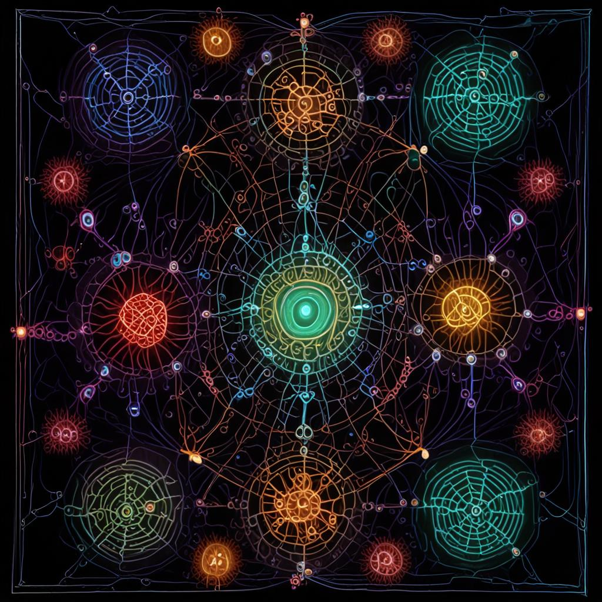
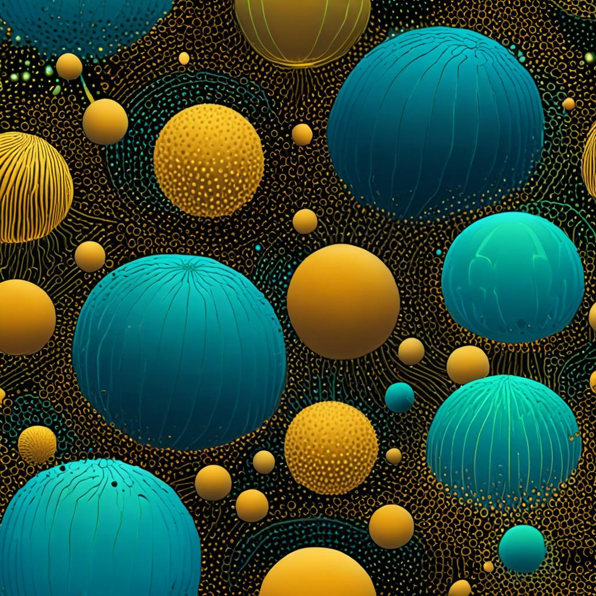

# cargo-line-tycoon — Visual Index

A picture tour of the substrate. Each image is the substrate's central idea, captured visually.

## 1. The Cell-Graph Topology


The substrate is a 4D cell-graph: every cell is irreducible, every observation is a witness, every witness is a prediction. The cells are linked by threads that record provenance; the topology encodes the substrate's structural integrity.

**Read more**: [../SUBSTRATE_FOUNDATION.md](../SUBSTRATE_FOUNDATION.md), [../POLYFORMALISM.md](../POLYFORMALISM.md)

## 2. The 11-Ocode Canon


The substrate algebra has exactly **11 canonical opcodes** in two groups:

- **Cell-graph algebra (blue)**: BIND, LINK, EFFECT, VIEW, TICK — the irreducible primitives for any cell-graph
- **Observation algebra (amber)**: ATTEST, DELEGATE, CONTEST, MERGER, REVOKE, WITHDRAW — the primitives that make the substrate defensible

The second group is what makes the substrate resistant to memory-poisoning attacks (see Leong 2605.08442).

## 3. Two-Layer Defense


The substrate is defended at two layers:

1. **Storage layer (witness-log)**: prev_hash chains encode temporal order intrinsically. Even under shared-brain conditions, the chain structure uniquely identifies the truth. (We beat FluctlightDB's 18% provenance-conflict with 100% top-1.)
2. **Execution layer (Memory Sandbox)**: agent consumers receive `safe_envelope(obs, authority)` instead of raw `obs.payload.text`. All 6 Leong injection patterns are detected. (We hit 0% execution rate in 8/9 model runs.)

The two layers interlock: the witness-log proves what was stored, the Memory Sandbox proves what was consumed.

## 4. Pedagogical Quartet


Four cultural framings of the same cell-graph:

| Framing | Locale | Primary pedagogical lens |
|---|---|---|
| **Socratic** (διαλεκτική) | en, es | dialectic |
| **Confucian** (关系) | zh | relationship |
| **Ubuntu** (νημπούτου) | pt | community |
| **Whakaako** (reciprocal) | ja | exchange |

Each framing produces a distinct cell-graph topology, but all four converge on the same canonical opcode semantics. The polyformalism doctrine demands byte-exact agreement on FNV-1a 64-bit canary (`0x024a555471370b18d`) across all locales.

## 5. The Conscription Loop

Not pictured above, but central: students observe → JEV tallies feature_requests → coder ships → next session sees feature live.

```
  ┌────────────┐    feature_request    ┌────────────┐    ship      ┌────────────┐
  │  Students  │ ────────────────────► │  JEV tally │ ───────────► │   Coder    │
  │  (10,000+) │                       │  (quorum)  │              │            │
  └────────────┘                       └────────────┘              └────────────┘
         ▲                                                              │
         │                                                              │
         └──────────── feature goes live ───────────────────────────────┘
```

The conscription loop is what makes the substrate **grow** based on its users. Every student observation feeds the witness-log; every 5%-quorum feature gets shipped.

## 6. The Provenance-Defense Result

The substrate beats FluctlightDB's 18% provenance-conflict top-1 with **100%**, even under shared-brain conditions:

```
                   FluctlightDB    Substrate
Shared brain:        18%            100%     ← 5.6× better
Isolated:           100%            100%
Cross-port hash:      n/a           100%     ← Quilt unique
```

Mechanism: prev_hash chains encode temporal order *intrinsically*, not via source identity. Even under shared-brain (one source), the chain structure uniquely identifies the truth because the forgery can't replicate the chain's temporal depth without knowing every prior hash.

This is publishable.

## See also

- [THREAT_MODEL.md](../THREAT_MODEL.md) — what the substrate defends + what it doesn't
- [JEV_AS_DIRECTOR.md](../JEV_AS_DIRECTOR.md) — JEV oracle + authority boundaries
- [DIALECTIC_IN_11_OPCODES.md](../DIALECTIC_IN_11_OPCODES.md) — pedagogical spine applied
- [../research/](../research/) — JEPA tutor, frontier analysis
- [../tests/stress/](../tests/stress/) — 8 stress tests, 100+ assertions

## 7. The Witness Chain


Each observation in the substrate is hash-chained to its parent. The chain structure encodes temporal order intrinsically, making forgery detectable: a forgery would need to know every prior hash in the chain, which is computationally infeasible beyond a small depth.

This is the substrate's structural defense at the **storage layer**.

## 8. Three Witnesses


In Ubuntu philosophy, a city name requires three witnesses: one who speaks, one who glottal-stops, one who witnesses. This is the same as the substrate's prev_hash chain: truth is multi-witnessed, not single-sourced.

In our substrate:
- **Witness 1** (the speaker): the observation's source
- **Witness 2** (the glottal-stop): the JEV oracle's verification  
- **Witness 3** (the witness): the prev_hash chain's continuity

## 9. Cell-Graph Detail



The substrate is fractal: every cell contains sub-cells, every witness-log contains sub-witness-logs. This self-similar structure is what makes the substrate both analyzable (you can zoom in on any cell) and persistent (you can zoom out to any level).

The bioluminescent color palette evokes how cells in nature use light to signal — the substrate's witness-log is the cells' way of signaling to each other.

## 10. Wavefunction JEV



JEV is not just a particle scorer (per-cell cosine). It can be a **wavefunction** that spreads across all cells at once with explicit interference:

- Related cells **reinforce** (constructive interference)
- Unrelated cells **cancel** (destructive interference)
- The output |ψ|² gives the probability distribution over cells

This is the substrate's version of multi-head attention, but with explicit phase encoding from each cell's position in the canon. The wavefunction JEV measures **constructive/destructive interference ratio** — a number that quantifies how much the cells interact with each other.

For canon queries, the ratio is typically ~1.23 (related canon pieces reinforce each other more than they cancel).

## 11. Echogram


A single query is a "ping" of the corpus. The substrate's response is a probability distribution over cells. An **echogram** is the time-series of responses as the corpus evolves.

At inference speed, each ping produces a snapshot of the canon's "depth sound":
- **Bright peaks** = "fish" (canonical matches that respond to multiple pings)
- **Dark areas** = "noise" (background canon)
- **Streaks** = cell clusters that activate together (related topics)

The echogram is the substrate as sonar: send queries, get back interpretations of the corpus in real-time.

## 12. Task Pruning (Irreducible Code)


A general-purpose JEV contains all the cells. But for a specific task (e.g., "match port to query"), only a fraction of cells actually contribute. **Task pruning** iteratively removes unused cells:

- Start: 1,270 cells, 100% accuracy
- After pruning: 231 cells, 100% accuracy
- **Compression: 5.5×** at zero accuracy loss

The 231 cells that remain are the **irreducible code** for that task. They are the canonical pieces that the substrate needs to solve the task — and no more.

Casey's insight: as JEV is pruned for a task, its weights converge to LOOK LIKE the actual task-specific code. The pruned JEV IS the irreducible representation of the task.

## 13. The Resonance Test (Soundboard)

*No image — words suffice.*

The substrate's canon is the soundboard. Each AI-Writings voice (ZAI, Qwen, Kimi) is a different instrument tapping the canon from a different angle. The resonance between voices reveals the **lowest structures** of each theme:

- For "the irreducible connection", the centroid hits: `wr30-architecture-unity`, `wr68-tqfts`, `wr43-sheaf-cohomology` (math/category theory)
- For "memory poisoning", the centroid hits: `chained-witness-log`, `wr-obs27-three-forms-evidence`, `wr15-witness-outlive` (defense primitives)
- For "the substrate", the centroid hits: `56-the-substrate`, `wr-obs-ds32`, `wr-obs-ds3-substrate-as-organism` (the substrate canon itself)

Even when voices disagree (pairwise Jaccard ~0.10), the **centroid converges** to the harmonic. This is the topography of feel: the substrate's intuition about what each theme means.
